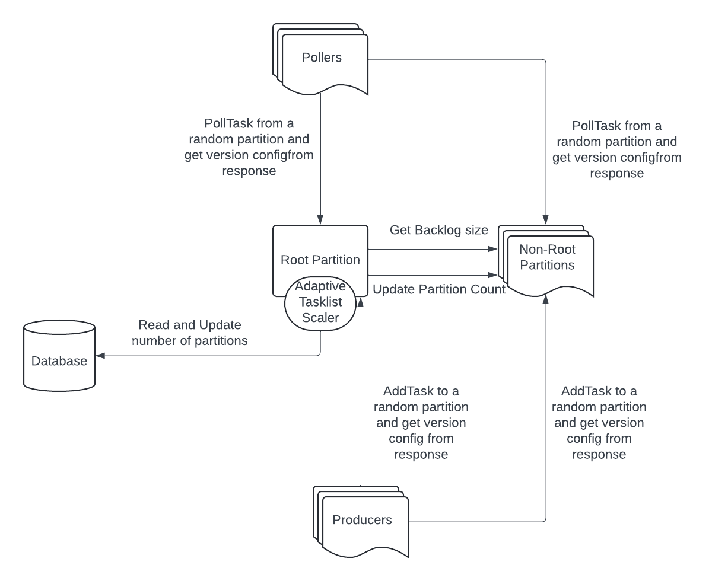

At Uber, we previously relied on a dynamic configuration service to manually control the number of partitions for scalable tasklists. This configuration approach introduced several operational challenges:

- **Error-prone:** Manual updates and deployments were required.
- **Unresponsive:** Adjustments were typically reactive, often triggered by customer reports or observed backlogs.
- **Irreversible:** Once increased, the number of partitions was rarely decreased due to the complexity of the two-phase process, especially when anticipating future traffic spikes.

To address these issues, we introduced a new component in the Cadence Matching service: **Adaptive Tasklist Scaler**. This component dynamically monitors tasklist traffic and adjusts partition counts automatically. Since its rollout, we've seen a significant reduction in incidents and operational overhead caused by misconfigured tasklists.

---

## What is a Scalable Tasklist?

A **scalable tasklist** is one that supports multiple partitions. Since Cadence’s Matching service is sharded by tasklist, all requests to a specific tasklist are routed to a single Matching host. To avoid bottlenecks and enhance scalability, tasklists can be partitioned so that multiple Matching hosts handle traffic concurrently.

These partitions are transparent to clients. When a request arrives at the Cadence server for a scalable tasklist, the server selects an appropriate partition. More details can be found in [this document](https://github.com/cadence-workflow/cadence/blob/v1.3.1/docs/scalable_tasklist.md).

### How Is the Number of Partitions Manually Configured?

The number of partitions for a tasklist is controlled by two dynamic configuration properties:

1. [`matching.numTasklistReadPartitions`](https://github.com/cadence-workflow/cadence/blob/v1.2.13/common/dynamicconfig/constants.go#L3350): Specifies the number of **read** partitions.
2. [`matching.numTasklistWritePartitions`](https://github.com/cadence-workflow/cadence/blob/v1.2.13/common/dynamicconfig/constants.go#L3344): Specifies the number of **write** partitions.

To prevent misconfiguration, a guardrail is in place to ensure that the number of read partitions is **never less than** the number of write partitions.

When **increasing** the number of partitions, both properties are typically updated simultaneously. However, due to the guardrail, the order of updates doesn't matter—read and write partitions can be increased in any sequence.

In contrast, **decreasing** the number of partitions is more complex and requires a **two-phase process**:

1. **First**, reduce the number of write partitions.
2. **Then**, wait for any backlog in the decommissioned partitions to drain completely.
3. **Finally**, reduce the number of read partitions.

Because this process is tedious, error-prone, and backlog-sensitive, it is rarely performed in production environments.

---

## How Does Adaptive Tasklist Scaler Work?

The architecture of the adaptive tasklist scaler is shown below:

### 1. Migrating Configuration to the Database

The first key change was migrating partition count configuration from dynamic config to the Cadence cluster’s database. This allows the configuration to be updated programmatically.

- The **adaptive tasklist scaler** runs in the root partition only.
- It reads and updates the partition count.
- Updates propagate to non-root partitions via a **push model**, and to pollers and producers via a **pull model**.
- A **version number** is associated with each config. The version only increments through scaler updates, ensuring monotonicity and consistency across components.

### 2. Monitoring Tasklist Traffic

The scaler periodically monitors the **write QPS** of each tasklist.

- If QPS exceeds an upscale threshold for a sustained period, the number of **read and write partitions** is increased proportionally.
- If QPS falls below a downscale threshold, only the **write partitions** are reduced initially. The system then waits for drained partitions to clear before reducing the number of **read partitions**, ensuring backlog-free downscaling.

---

## Enabling Adaptive Tasklist Scaler

### Prerequisites

To use this feature, upgrade Cadence to [v1.3.0 or later](https://github.com/cadence-workflow/cadence/tree/v1.3.0).

Also, migrate tasklist partition configurations to the database using [this guide](https://github.com/cadence-workflow/cadence/blob/v1.3.0/docs/migration/tasklist-partition-config.md).

### Configuration

The scaler is governed by the following dynamic configuration parameters:

- `matching.enableAdaptiveScaler`: Enables the scaler at the tasklist level.
- `matching.partitionUpscaleSustainedDuration`: Duration that QPS must stay above threshold before triggering upscale.
- `matching.partitionDownscaleSustainedDuration`: Duration below threshold required before triggering downscale.
- `matching.adaptiveScalerUpdateInterval`: Frequency at which the scaler evaluates and updates partition counts.
- `matching.partitionUpscaleRPS`: QPS threshold per partition that triggers upscale.
- `matching.partitionDownscaleFactor`: Factor applied to introduce hysteresis, lowering the QPS threshold for downscaling to avoid oscillations.

---

## Monitoring and Metrics

Several metrics have been introduced to help monitor the scaler’s behavior:

### QPS and Thresholds

- `estimated_add_task_qps_per_tl`: Estimated QPS of task additions per tasklist.
- `tasklist_partition_upscale_threshold`: Upscale threshold for task additions.
- `tasklist_partition_downscale_threshold`: Downscale threshold for task additions.

> The `estimated_add_task_qps_per_tl` value should remain between the upscale and downscale thresholds. If not, the scaler may not be functioning properly.

### Partition Configurations

- `task_list_partition_config_num_read`: Number of current **read** partitions.
- `task_list_partition_config_num_write`: Number of current **write** partitions.
- `task_list_partition_config_version`: Version of the current partition configuration.

These metrics are emitted by various components: root and non-root partitions, pollers, and producers. Their values should align under normal conditions, except immediately after updates.

---

## Status at Uber

We enabled adaptive tasklist scaler across all Uber clusters in **March 2025**. Since its deployment:

- **Zero incidents** have been reported due to misconfigured tasklists.
- **Operational workload** related to manual scaling has been eliminated.
- **Scalability and resilience** of Matching service have improved significantly.
