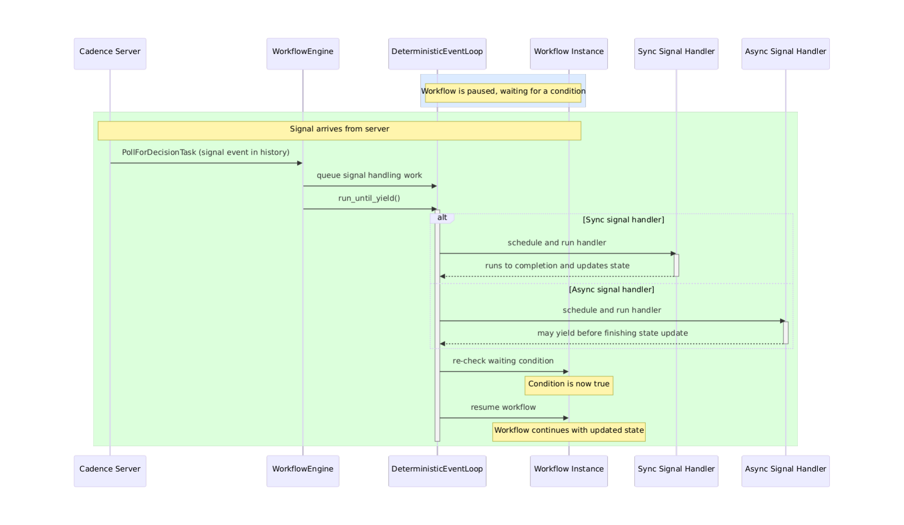

Signals are how the outside world communicates with a running Cadence workflow without interrupting it. Consider a document approval workflow that runs for days or weeks: at any moment, a manager clicks "Approve" on a dashboard and that signal needs to reach the workflow immediately — without restarting it or losing its place. Whether you're building human-in-the-loop approvals, broadcasting configuration changes to thousands of running workflows, coordinating multi-stage pipelines, or implementing liveness checks — signals are the right tool. We're excited to share that signal handling is now available in the newest release of **Cadence Python client**.

<!-- truncate -->

## What Are Signals?

Signals differ from activities in three important ways: they carry no return value, they must never fail the workflow on delivery, and they arrive asynchronously relative to the workflow's own execution. A workflow must be able to receive a signal at any point during its run — regardless of what it is currently doing.

Common use cases include:

- **Human-in-the-loop approvals** — pause a workflow until a reviewer sends a signal
- **Configuration broadcasts** — push a new setting to all running instances simultaneously
- **Pipeline coordination** — one workflow signals another to proceed to the next stage
- **Periodic liveness checks** — external systems signal a workflow to confirm it is still alive

## Registering a Signal Handler

Signal handlers are defined by decorating a workflow method with `@workflow.signal(name=...)`:

```python
class ApprovalWorkflow:
    def __init__(self):
        self.approvals = 0
        self.required = 2

    @workflow.signal(name="approve")
    def approve(self) -> None:
        self.approvals += 1

    @workflow.run
    async def run(self) -> str:
        await workflow.wait_condition(lambda: self.approvals >= self.required)
        return "fully approved"
```

During the workflow-definition setup phase, the SDK scans the workflow class and builds a mapping from each signal name to its handler. At runtime, when the workflow engine encounters a signal event in the decision-task history, it looks up the signal name in this map, decodes the payload according to the handler's type signature (so handlers can accept typed arguments — the SDK handles deserialization), and schedules the handler on the deterministic event loop. If no handler is registered for a received signal name, the signal is logged and dropped — it will never fail the workflow.

## Sending a Signal from a Python Client

Once the workflow is running, another Python process can signal it with `client.signal_workflow(...)`. The API takes the target workflow ID, run ID, signal name, and any signal arguments:

```python
await client.signal_workflow(
    workflow_id,
    run_id,
    "approve",
)
```

If your signal handler accepts parameters, pass them positionally after the signal name:

```python
await client.signal_workflow(workflow_id, run_id, "my_signal", "hello")
```

Those extra arguments are serialized by the client and deserialized into the handler parameters when the workflow processes the signal event.

## How Signal Dispatch Works

When the Cadence server delivers a decision task, the workflow engine iterates the task's history in order. When a signal event appears, the engine does **not** invoke the handler immediately. Instead, signal handling work is queued and processed in FIFO order. This is the key to replay safety: during replay, the same history produces the same queued work, so signals are always handled in the same order regardless of when the decision task was originally executed.

**Sync handlers** run to completion before the event loop moves on. **Async handlers** follow the same dispatch path, but pause at an `await` point and resume in a subsequent loop turn. If another signal arrives while an async handler is suspended, it is queued and processed by the same event loop in deterministic order — it is never allowed to race ahead. In both cases, signal handling is driven entirely by the deterministic event loop.



*WorkflowEngine reads the signal event from history, queues handling work on the DeterministicEventLoop, and the loop schedules and runs the handler (sync or async) before checking waiting conditions and resuming the workflow.*

## Why Determinism Matters

You might wonder: why does the SDK queue signals instead of invoking handlers immediately when they arrive? The answer is determinism — and it's critical to how Cadence workflows work.

Every workflow can be interrupted at any moment: the process crashes, the network breaks, the host is restarted. When the workflow resumes, Cadence replays the entire history to reconstruct exactly where it was. During replay, every decision must produce the same result it did originally. This is how Cadence guarantees fault-tolerant execution.

If signals were processed in real-time as they arrived, replay would be non-deterministic. A signal arriving at a slightly different moment during replay could change the flow. By recording signals in history order and replaying them in that same FIFO order, the workflow sees identical signals in an identical sequence — triggering identical state changes — every single time.

This is why `wait_condition` is the right primitive for signal-driven pausing, rather than a polling loop: it integrates with the same deterministic event loop that drives the entire workflow.

## Pausing with `wait_condition`

This replay-safe dispatch pairs naturally with `wait_condition`, which lets workflow code pause until a signal has updated enough state to proceed. For example, waiting for N approvals before moving on:

```python
await workflow.wait_condition(lambda: self.approvals >= self.required)
```

Under the hood, `wait_condition` works like this:

```text
when workflow calls wait_condition(predicate):
    create a waiter for the predicate
    if predicate is already true:
        continue immediately
    else:
        pause workflow

on each event loop iteration:
    run queued callbacks
    re-check each waiter's predicate
    if a predicate becomes true:
        resolve that waiter
        queue the blocked workflow to continue
```

The ordering matters: a signal handler finishes updating workflow state **before** the event loop re-checks any waiting conditions. This means a workflow can resume in the very same event loop iteration that delivered the signal — no extra round-trip required. If the predicate is already true when `wait_condition` is called, the workflow continues immediately without suspending. If the required signals never arrive and the workflow itself has no timeout, `wait_condition` will block indefinitely — so set a workflow execution timeout if unbounded waiting is not acceptable.

Taking the `ApprovalWorkflow` above as an example: the workflow starts and immediately awaits `wait_condition` since `self.approvals` is 0. When the first `"approve"` signal arrives, the handler increments `self.approvals` to 1. The event loop re-checks the predicate — it's still false — so the workflow stays paused. When the second signal arrives, `self.approvals` becomes 2, the predicate becomes true, and the workflow is queued to resume and return `"fully approved"`.


Have questions or feedback? Leave a comment on [GitHub issue](https://github.com/cadence-workflow/cadence-python-client/issues/94)
