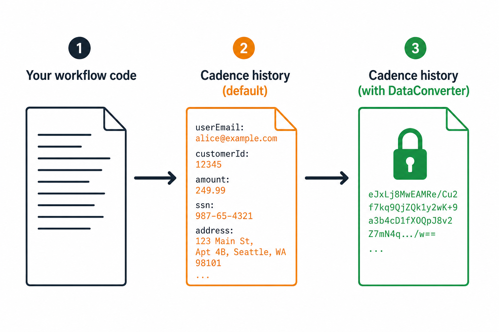

import PatternCards from './PatternCards';
import PayloadFlow from './PayloadFlow';

That customer order you passed into your fulfillment activity (the one with the email address, the shipping details, and the internal pricing fields) is sitting in your workflow history as plaintext JSON right now. Anyone with read access to Cadence history can see it. So can anyone with access to your history storage backend.

This is not a bug. It is how Cadence works by design, and it is the right default for most workloads. But three problems follow from it in production, and most teams hit at least one of them before they know the solution exists.

<!-- truncate -->

## Are your workflows affected?

<PatternCards />

If none of those apply, the default JSON converter is probably fine.

## See it in action

Select a pattern and send a payload through to see what lands in history.

<PayloadFlow />

Ready to implement? The **[DataConverter Guide](/docs/concepts/data-converter)** has wiring examples, interface signatures, and production considerations for all three patterns.

## What DataConverter does not see

The converter intercepts payloads crossing the history boundary. It does not touch:

- **Search attributes:** indexed and queryable, but outside the converter path
- **Memo:** uses the default JSON converter unless you wrap that path separately
- **Application logs and metrics:** separate disclosure surfaces entirely

Encrypting your payloads does not encrypt these. If any of them carry sensitive data, that is a separate data-governance problem. Week 3 of this series maps out the full picture.

## What's next in this series

**Week 2: Bypass the 2 MB Limit Without Shrinking Your Workflow**

A deep dive into the claim-check pattern: how to keep only a reference in history, why blob keys must be deterministic (SHA-256, not UUID), and how to run the Go and Java samples against a live cluster with local-FS, S3, GCS, or MinIO as the backing store.

**Week 3: Encrypt Cadence History Payloads (And Know What You Didn't Encrypt)**

Key management, the `CADENCE_ENCRYPTION_KEY` environment variable, and a practical map of what AES-256-GCM encryption protects in Cadence versus what it leaves exposed. If you handle regulated data, this is the post to bookmark.

## Get started

- [DataConverter Guide](/docs/concepts/data-converter)
- [Go samples](https://github.com/cadence-workflow/cadence-samples/tree/master/new_samples/data)
- [Java samples](https://github.com/cadence-workflow/cadence-java-samples)
- [Community and support](/community/contact-us)
