Cadence is a multi-tenant workflow orchestration platform, where a single cluster can serve many domains running different types of workflows. When a domain has a sudden traffic spike, it can consume a disproportionate share of resources used for history task processing and degrade performance for other domains in the same cluster, which is a noisy neighbor problem.

As the scale and diversity of workloads in a Cadence cluster grow, isolation between domains becomes increasingly important for maintaining predictable performance and reliability. To address this challenge, we redesigned two key components of the Cadence History service—the history task scheduler and history queue—to provide stronger domain-level isolation.
<!-- truncate -->

## The Old Architecture

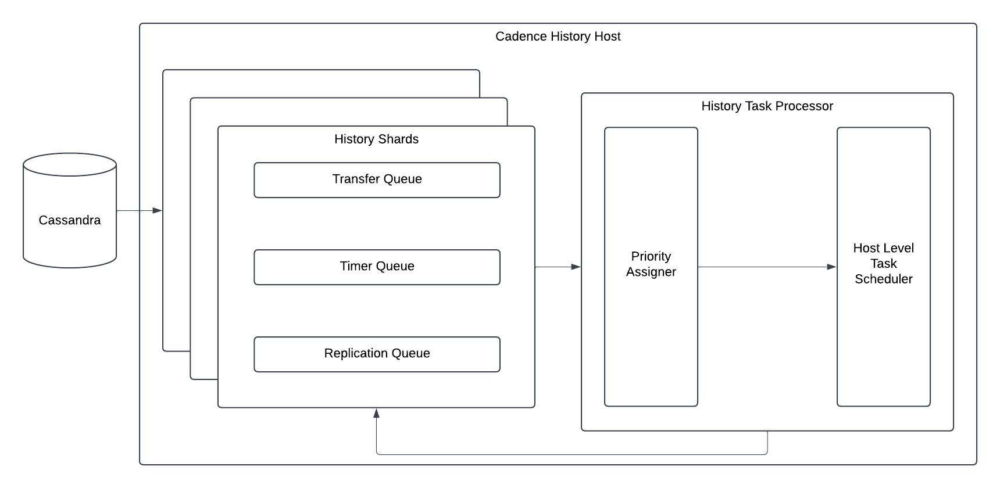

The diagram above shows the overall architecture of history task processing. A shard-level history queue reads tasks from the database and sends them to a host-level history task scheduler, which schedules the tasks for processing.


### History Queue

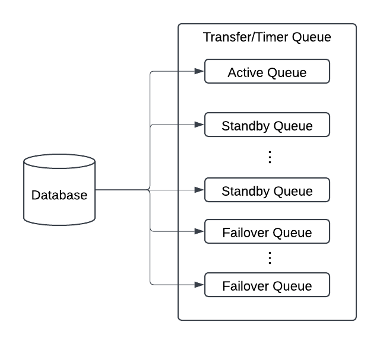

The diagram above shows the detailed architecture of the history queue within a single shard. Each shard has one active queue and \(N - 1\) standby queues, where \(N\) is the number of clusters in the replication group. Failover queues are ephemeral and are created only when a domain failover occurs.

For example, consider a Cadence deployment with two clusters, `primary` and `secondary`. In the `primary` cluster, the active queue reads tasks from the database and filters out tasks belonging to domains that are not active in `primary`. The standby queue also reads tasks from the database, but filters out tasks belonging to domains that are not active in `secondary`. During a domain failover, a temporary failover queue is created to process tasks for the domain undergoing failover.

#### Tracking Progress
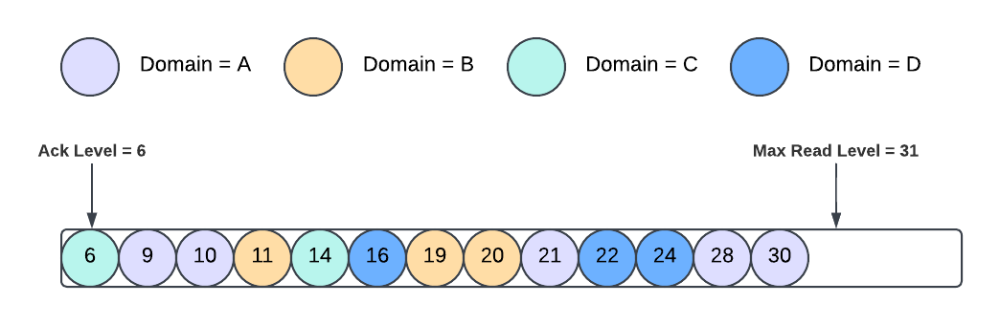

The history queue persists cursors in the database to track task processing progress:
- **Ack Level**: The highest point below which all tasks have been processed and deleted from the database. Each active queue and standby queue has a separate ack level.
- **Max Read Level**: The upper bound of tasks which have been created. The active and standby queues within the same shard share the same max read level.

On shard reload, each queue resumes processing tasks withing range [**Ack Level**, **Max Read Level**), and new task IDs are allocated starting from the max read level.

> **NOTE**: Active and standby queues maintain separate ack levels to avoid head-of-line blocking. Standby tasks may need to wait for replication before they can be processed. If active and standby tasks shared the same ack level, a delayed standby task could prevent the ack level from advancing even when subsequent active tasks have already been processed.
>
> Task processing must still be idempotent. Persisting processing progress in the database does not eliminate the possibility of duplicate task execution.

### History Task Scheduler
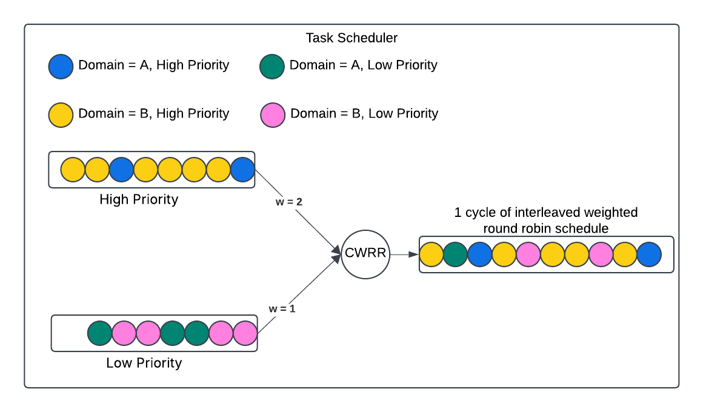

Priorities are assigned to tasks before they are submitted to the scheduler. The scheduler uses a **weighted round-robin** algorithm to schedule tasks across different priority levels, with higher-priority tasks receiving a larger scheduling weight. Tasks with the same priority are scheduled in **FCFS** order, regardless of their domains.

By default, tasks from active domains are assigned high priority, while tasks from standby domains are assigned low priority. A rate limiter is applied to high-priority tasks from active domains to prevent them from consuming excessive scheduling capacity. When the rate limit is exceeded, additional active-domain tasks are assigned low priority and scheduled alongside other low-priority tasks.

## The Problem: Noisy Neighbor Effect

As you can see from the old architecture, all domains in the same cluster share the history queue and task scheduler components. These components provide no domain-level isolation, so a traffic spike in one domain can consume shared resources and negatively impact other domains, resulting in a noisy neighbor problem. The rate limiter on high-priority tasks does not address this issue because it limits aggregate traffic rather than ensuring fair scheduling across individual domains. 

### Real-World Scenarios
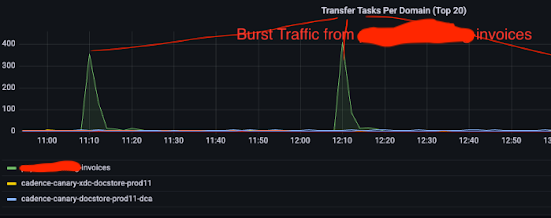
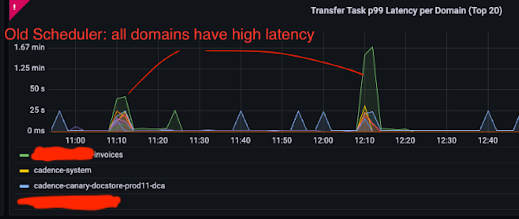

The diagrams above show a real-world example of the noisy neighbor effect. The invoices domain experiences periodic traffic spikes, and during each spike, the task processing latency of other domains increases as well, demonstrating how traffic from one domain can impact the performance of others sharing the same cluster.

## The New Architecture
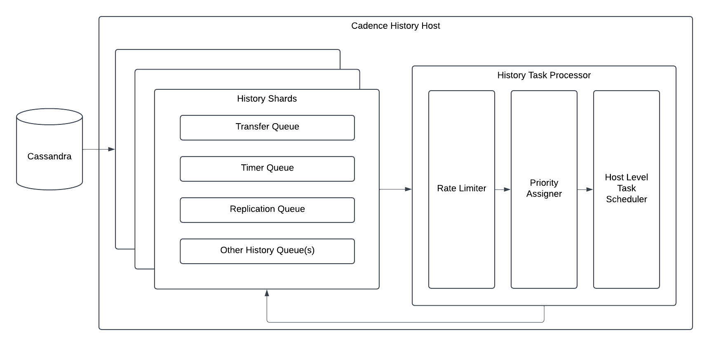

The high-level architecture remains largely unchanged. We added a domain-level task rate limiter before the priority assigner to rate-limit history tasks based on their domains.

### History Queue v2
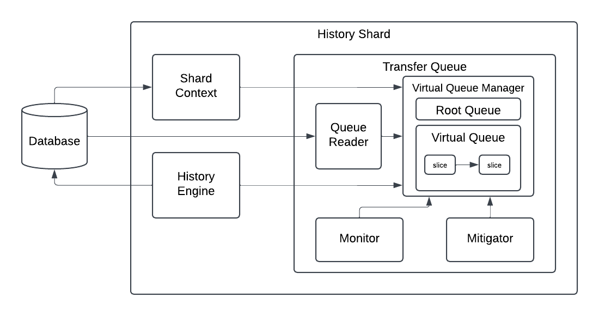

The new history queue uses a layered structure to process tasks while preventing one slow domain from blocking others. Layers, from the outermost to the innermost layer:

- **Shard context** - Fetches and tracks the queue processing progress from the database.
- **History engine** - Appends tasks to the database and notifies the transfer/timer queue to fetch new tasks from the database.
- **Transfer/Timer queue** - the event loop. Manages timing (when to wake up, when to persist state) and owns the root virtual queue.
- **Virtual queue manager** - Manages a set of virtual queues. Under normal conditions, there is only one—the root queue. When a domain generates too many tasks, the mitigator creates additional virtual queues to isolate and throttle that domain.
- **Virtual queue** - Each virtual queue runs its own goroutine and processes an ordered list of virtual slices sequentially. It is an isolation unit of the history queue. New tasks are always added to the root queue.
- **Virtual slice** - Represents a range of tasks with an associated filter. It is the smallest processing unit.
- **Monitor** - Detects when a domain generate too many tasks and sends a notification to the mitigator.
- **Mitigator** - Creates additional virtual queues to isolate and throttle tasks from overloaded domains.
- **Queue reader** - Fetches tasks from the database.

#### Virtual Slice Operations
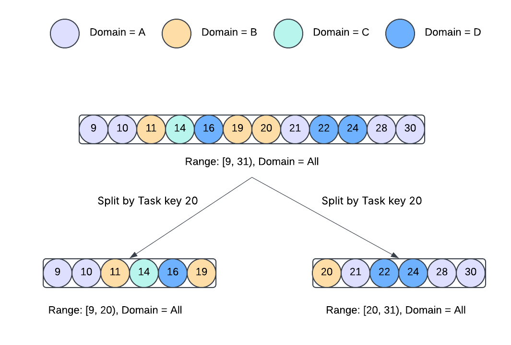
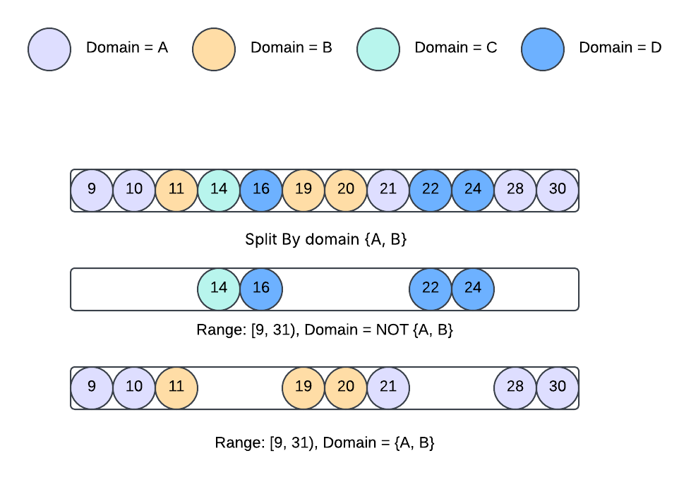
**Split**: A virtual slice can be splitted by a task key or domainIDs. The diagrams above shows how a virtual slice are splitted by a task key and domainIDs.

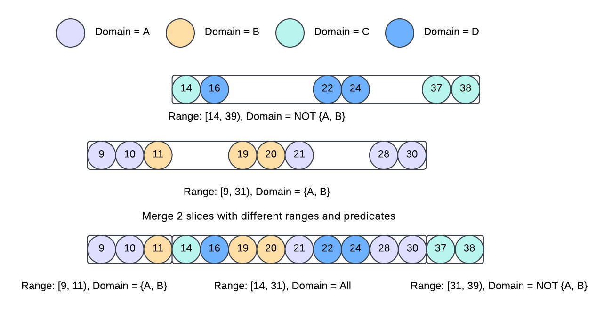
**Merge**: 2 slices can be merged. The diagram above shows the most complex merge scenario. A merge operation of 2 virtual slices can produce 1 to 3 virtual slices.

#### Virtual Queue State
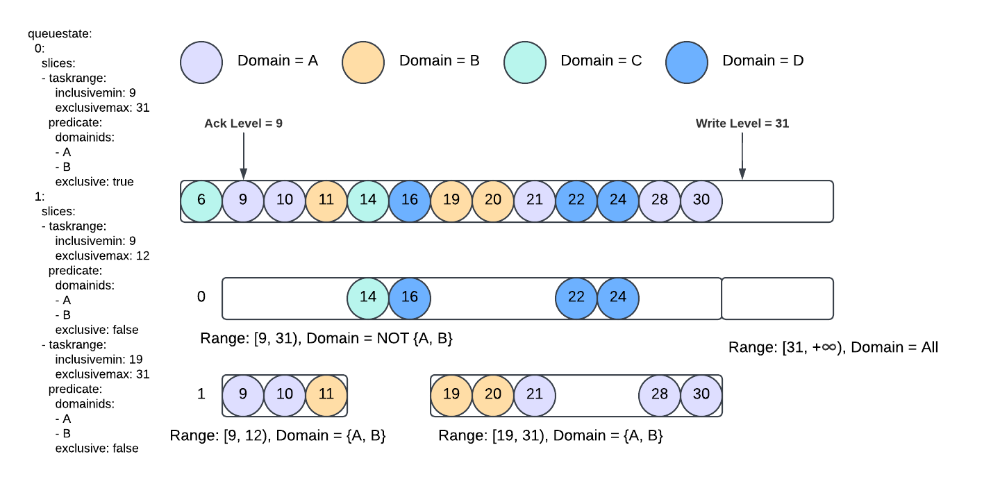
The virtual queue structure generalizes the existing active/standby queue model, providing greater flexibility for isolating and managing different groups of tasks. Similar to how the ack levels of active and standby queues are persisted separately, the state of each virtual queue is also persisted in the database. The diagram above shows an example of the persisted virtual queue state.

### History Task Scheduler
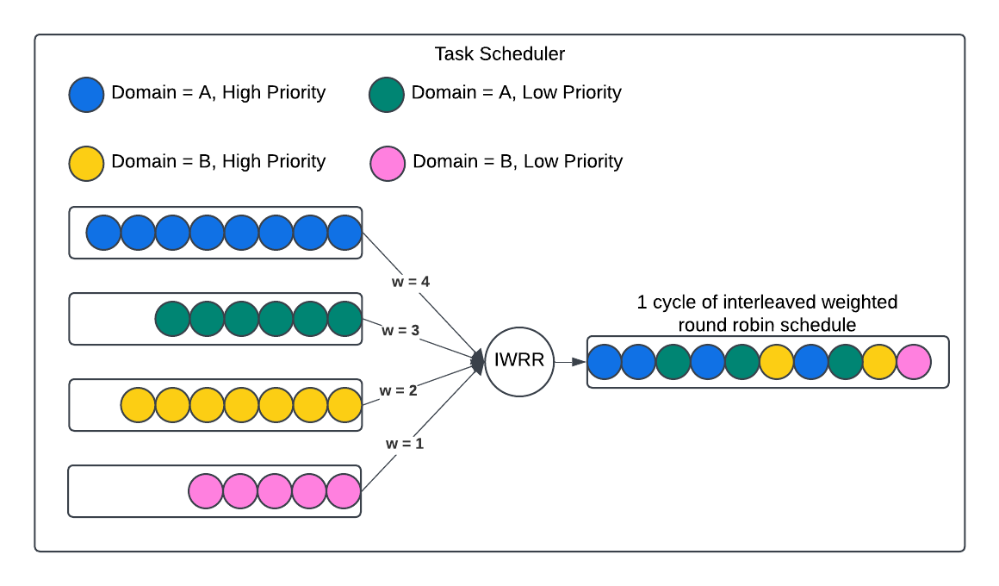
The diagram above shows how the task scheduler schedules tasks from different domains with different priorities. When a task is submitted to the task scheduler, it’s appended to a queue based on its domain and priority (priority is assigned by priority assigner based on its type), and the scheduler processes the queues with a weighted round-robin algorithm. The weights are configurable, but by default, each domain is assigned the same weight, ensuring that all domains receive a fair share of the scheduling capacity.

## Improvements Observed at Uber
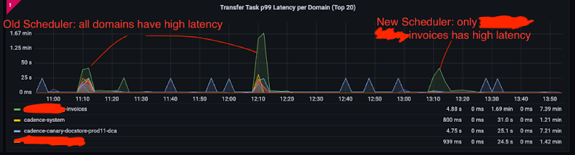
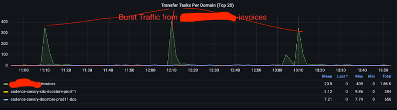
After switching to the new implementation, it is very obvious that the traffic spike from invoices domain no longer increased the task processing latency for other domains.
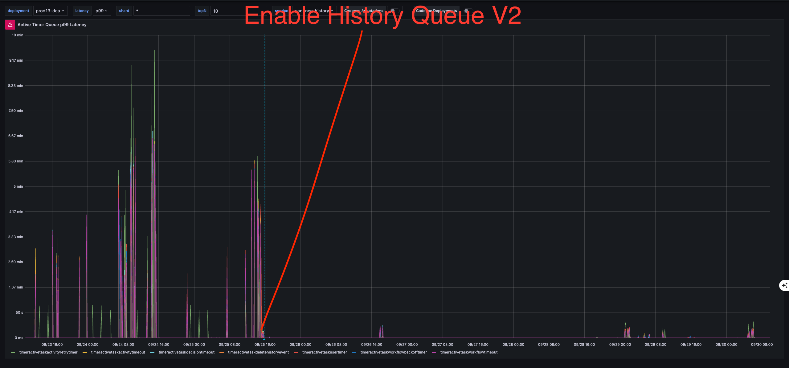
Besides, the overall p99 latency also became less spiky after enabling history queuev2 at Uber.

## How to Enable the New Features

### Prerequisites

To use this feature, upgrade Cadence server to [v1.4.0 or later](https://github.com/cadence-workflow/cadence/tree/v1.4.0).

### Configuration

History Queue V2 is controlled by the following feature flags:
* `history.enableTransferQueueV2`: Enables History Queue V2 for the transfer queue. Defaults to `false` and requires a service restart to take effect. Can be configured by `ShardID`.

* `history.enableTimerQueueV2`: Enables History Queue V2 for the timer queue. Defaults to `false` and requires a service restart to take effect. Can be configured by `ShardID`.

* `history.enableTransferQueueV2PendingTaskCountAlert`: Enables virtual queue splitting for the transfer queue when the pending task count exceeds the configured threshold. Defaults to `false` and can be configured by `ShardID`.

* `history.enableTimerQueueV2PendingTaskCountAlert`: Enables virtual queue splitting for the timer queue when the pending task count exceeds the configured threshold. Defaults to `false` and can be configured by `ShardID`.

* `history.queueMaxPendingTaskCount`: Defines the maximum number of pending tasks allowed in a history queue per shard. Defaults to 10000. Once this limit is reached, the queue stops reading additional tasks from the database until the pending task count decreases.

* `history.queueCriticalPendingTaskCount`: Defines the pending task count threshold that triggers a virtual queue split. Defaults to 9000. It must be less than `history.queueMaxPendingTaskCount`.

The History Task Scheduler is controlled by the following feature flags:

* `history.taskSchedulerGlobalDomainRPS`: Defines the global task processing rate limit, in requests per second (RPS), for each domain. Can be configured by `domainName`.

* `history.taskSchedulerEnableRateLimiter`: Enables rate limiting in the History Task Scheduler. Defaults to false. When enabled, task processing is throttled according to the configured domain-level rate limits.

* `history.taskSchedulerEnableRateLimiterShadowMode`: Enables shadow mode for the History Task Scheduler rate limiter. Defaults to true. Can be configured by `domainName`. In shadow mode, rate-limit decisions are evaluated and recorded for observability, but tasks are not actually throttled.

* `history.taskSchedulerDomainRoundRobinWeight`: Defines the weight assigned to each domain by the task scheduler's weighted round-robin scheduling algorithm. Can be configured by `domainName`. The weight determines the relative share of task processing capacity allocated to each domain.


### Step-by-Step Enablement

1. **Update Cadence Server** - Deploy v1.4.0.
2. **Configure Dynamic Settings**

   * **2.a. Enable History Queue V2:** Set `history.enableTransferQueueV2` and `history.enableTimerQueueV2` to `true`, then restart `cadence-history` for the changes to take effect.
   * **2.b. Enable Virtual Queue Splitting:** Once you are confident that History Queue V2 is operating as expected, set `history.enableTransferQueueV2PendingTaskCountAlert` and `history.enableTimerQueueV2PendingTaskCountAlert` to `true`.
   * **2.c. Enable task scheduler rate limiter in shadow mode:** Set `history.taskSchedulerEnableRateLimiter` to true. 

### Monitoring and Observability

#### Key Metrics

- `task_scheduler_allowed_counter_per_domain` - Measures the number of tasks per domain that are allowed to proceed by the task scheduler's rate limiter. 
- `task_scheduler_throttled_counter_per_domain` - Measures the number of tasks per domain that are throttled by the task scheduler's rate limiter.

These metrics become available after setting history.taskSchedulerEnableRateLimiter to true. Use them to monitor task scheduling QPS for each domain and tune history.taskSchedulerGlobalDomainRPS accordingly.

At Uber, the rate limiter is kept in shadow mode by default. Shadow mode is disabled for individual domains only when needed to mitigate incidents. Disabling shadow mode is not recommended for latency-sensitive domains, as active rate limiting may increase task processing latency.

- `task_requests_per_domain`: Measures the QPS of task processing broken down by domain.
- `task_latency_per_domain_ns` or `task_latency_per_domain`: Measures task processing latency broken down by domain.
- `task_latency_ns` or `task_latency`: Measures aggregated task processing latency across domains.

Use these metrics to monitor the task processing latency. In particular, the per-domain task latency metric can help identify noisy-neighbor issues: a latency spike in one domain accompanied by increased latency in other domains may indicate that a high-traffic domain is a noisy neighbor.

#### Logs

```json
{
  "level": "warn",
  "msg": "Too many pending tasks, pause loading tasks for a while",
  "service": "cadence-history",
  "shard-id": "<shard-id>",
  ...
}
```
The log message above indicates that the queue is paused because of too many pending tasks in that shard.

## Try it now!

The new architecture has been running in production at Uber for over a year, and we have not observed noisy-neighbor issues since its rollout. We are also building new features on top of this architecture, which are available only when History Queue V2 is enabled by setting `history.enableTransferQueueV2` and `history.enableTimerQueueV2` to `true`.

In the next release, we plan to enable History Queue V2 by default and begin deprecating History Queue V1. We encourage you to try History Queue V2 now and share your feedback with us!


---

- **Ask a question** - [#cadence-users on CNCF Slack](https://inviter.co/cncf)
- **Open an issue** - [cadence on GitHub](https://github.com/cadence-workflow/cadence/issues)
- **Join the discussion** - [GitHub Discussions](https://github.com/cadence-workflow/cadence/discussions)