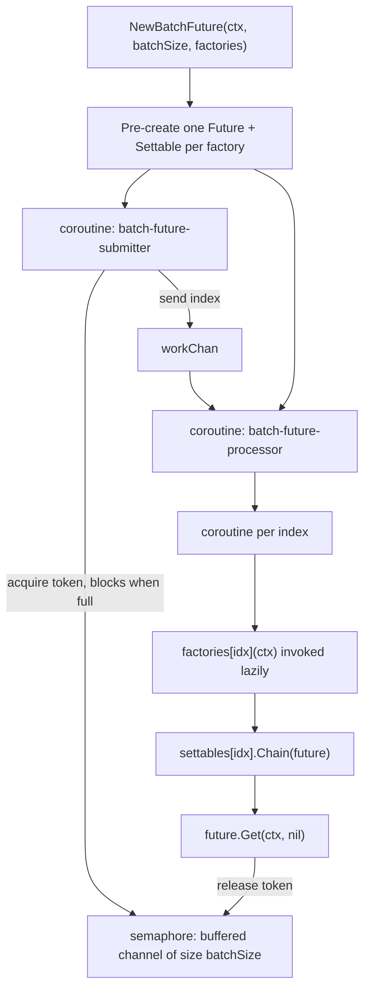

The straightforward way to process many items in a workflow is a loop over `workflow.ExecuteActivity`, collecting the futures and draining them afterwards:

```go
var futures []workflow.Future
for _, userID := range userIDs {
    futures = append(futures, workflow.ExecuteActivity(ctx, UpdateUserActivity, userID))
}
for _, f := range futures {
    if err := f.Get(ctx, nil); err != nil {
        return err
    }
}
```

This schedules every activity at once. With a few dozen items that is fine. With a few thousand it causes real problems: you hit the Cadence server's per-workflow pending-activity ceiling (1024 by default), you concentrate load on the history shard that owns the workflow, and you hand your downstream service a burst it may be rate-limited or simply unable to absorb.

`workflow.NewBatchFuture` solves exactly this. You hand it a concurrency limit and a slice of *factories*, which are functions that create a future when called. It keeps at most that many futures in flight, starting a queued one each time another finishes.

:::note
Batch Future bounds **in-flight** operations. It does not reduce the number of history events your workflow produces, so event-count and history-size limits are unaffected. The same 5,000 activities write the same number of events whether you schedule them all at once or ten at a time. If your problem is total history size rather than concurrency, reach for [Continue as new](/docs/go-client/continue-as-new) or [child workflows](/docs/go-client/child-workflows) instead.
:::

---

## Samples

Runnable Batch Future sample:

| Sample | Description | Code |
|--------|-------------|------|
| **Batch processing** | Fans out a configurable number of activities with a configurable concurrency limit, and handles cancellation | [concurrency](https://github.com/cadence-workflow/cadence-samples/tree/master/new_samples/concurrency) |

Start the worker from the sample directory with `go run .`, then trigger a run:

```bash
cadence --domain cadence-samples \
  workflow start \
  --workflow_type cadence_samples.BatchWorkflow \
  --tl cadence-samples-worker \
  --et 300 \
  --input '{"Concurrency":3,"TotalSize":10}'
```

---

## Version requirement

:::caution
`NewBatchFuture` lives in the stable `workflow` package as of Go client **v1.3.1-rc.10**. Earlier releases, including **v1.3.0**, ship the same feature from the experimental `x` package as `x.NewBatchFuture`.

Because v1.3.0 is the most recent non-prerelease tag at the time of writing, `go get go.uber.org/cadence@latest` resolves to a version that does **not** contain `workflow.NewBatchFuture`. Pin an explicit version if you want the stable-package API:

```bash
go get go.uber.org/cadence@v1.3.1-rc.10
```

The behavior is identical between the two; only the package and function name differ.
:::

---

## Basic usage

Build one factory per item, then pass the slice to `NewBatchFuture` with your concurrency limit. This is the sample's workflow:

```go
// BatchWorkflowInput configures the batch processing parameters.
type BatchWorkflowInput struct {
    Concurrency int // Maximum number of activities running in parallel
    TotalSize   int // Total number of activities to process
}

func BatchWorkflow(ctx workflow.Context, input BatchWorkflowInput) error {
    // Create activity factories for each task (not yet executed)
    factories := make([]func(workflow.Context) workflow.Future, input.TotalSize)
    for taskID := 0; taskID < input.TotalSize; taskID++ {
        taskID := taskID // Capture loop variable for closure
        factories[taskID] = func(ctx workflow.Context) workflow.Future {
            // Configure activity timeouts
            aCtx := workflow.WithActivityOptions(ctx, workflow.ActivityOptions{
                ScheduleToStartTimeout: time.Minute * 1,
                StartToCloseTimeout:    time.Minute * 1,
            })
            return workflow.ExecuteActivity(aCtx, BatchActivity, taskID)
        }
    }

    // Execute all activities with controlled concurrency
    batch, err := workflow.NewBatchFuture(ctx, input.Concurrency, factories)
    if err != nil {
        return fmt.Errorf("failed to create batch future: %w", err)
    }

    // Wait for all activities to complete
    return batch.Get(ctx, nil)
}
```

Two details in that snippet are easy to get wrong and cause bugs that are hard to trace:

- **`taskID := taskID` shadows the loop variable.** Without it, every closure captures the same variable and all your factories operate on the final value. (Go 1.22 changed loop-variable scoping, so this is only required if your module targets an earlier language version, but the explicit copy is harmless and makes the intent obvious.)
- **`workflow.WithActivityOptions` is applied inside the factory.** A factory receives a context from the batch machinery, not the one you closed over. If neither that context nor the parent carries activity options, `ExecuteActivity` returns an immediately-failed future complaining about missing timeouts.

Factories are not limited to activities. Anything that returns a `workflow.Future` works, including `workflow.ExecuteChildWorkflow`, so the same pattern bounds child-workflow fan-out.

---

## API reference

```go
func NewBatchFuture(ctx Context, batchSize int, factories []func(ctx Context) Future) (BatchFuture, error)

type BatchFuture interface {
    IsReady() bool
    Get(ctx Context, valuePtr interface{}) error
    GetFutures() []Future
}
```

| Method | Behavior |
|--------|----------|
| `IsReady()` | Returns true only when **every** wrapped future is ready. False while any item is still pending. |
| `Get(ctx, valuePtr)` | Blocks until all futures resolve, then writes every result into `valuePtr` in the same order as the input factories. `valuePtr` must be a pointer to a slice, or `nil`. |
| `GetFutures()` | Returns the per-item futures. Available immediately, before any factory has run. Do not modify the slice; the individual futures can be used normally, including in a `workflow.Selector`. |

`Get` accepts only two shapes of argument. Either a pointer to a slice, where the slice itself may be `nil` because it will be allocated or grown to fit, or `nil` to discard the results. Anything else returns `valuePtr must be a pointer to a slice, got ...` without waiting for the batch.

`BatchFuture` satisfies `workflow.Future`, so it can be passed where a plain future is expected. Note that its `Get` still expects a slice pointer rather than a single value, which makes it awkward to consume through the `Future` interface.

---

## Collecting results

Discard the results and only care whether everything succeeded:

```go
err := batch.Get(ctx, nil)
```

Collect them into a typed slice. You do not need to size the slice yourself:

```go
var results []string
if err := batch.Get(ctx, &results); err != nil {
    return err
}
// len(results) == len(factories), in factory order
```

Or read individual items through `GetFutures()`, which is what you want when you need to know *which* items failed:

```go
results := make([]string, len(factories))
for i, f := range batch.GetFutures() {
    if err := f.Get(ctx, &results[i]); err != nil {
        workflow.GetLogger(ctx).Error("item failed",
            zap.Int("index", i), zap.Error(err))
    }
}
```

---

## Error handling

A failing item does **not** stop the batch. Every factory runs to completion regardless of what the others do, and successful values are still written into your output slice. This is the single most important thing to understand about Batch Future, and it means the failure policy is yours to choose.

### Aggregate every failure

Bulk `Get` merges all errors with [`go.uber.org/multierr`](https://pkg.go.dev/go.uber.org/multierr). A single failure comes back as an ordinary error; multiple failures are bundled the way `errors.Join` bundles them. Unpack with `multierr.Errors`:

```go
var results []string
err := batch.Get(ctx, &results)
if err != nil {
    for _, e := range multierr.Errors(err) {
        workflow.GetLogger(ctx).Error("batch item failed", zap.Error(e))
    }
    return err
}
```

:::note
`multierr.Errors` gives you the failures but not their positions, because successful indices contribute no error to the merged value. If you need to correlate a failure back to its input item, iterate `GetFutures()` instead, where index `i` always corresponds to `factories[i]`.
:::

### Fail fast

Iterate the futures and return on the first error. The remaining items keep running in the background until the workflow completes or you cancel them:

```go
for i, f := range batch.GetFutures() {
    if err := f.Get(ctx, nil); err != nil {
        return fmt.Errorf("item %d failed: %w", i, err)
    }
}
```

### Fail fast and cancel the rest

Derive the batch's context from `workflow.WithCancel` so you can stop the remaining work:

```go
batchCtx, cancel := workflow.WithCancel(ctx)
defer cancel()

batch, err := workflow.NewBatchFuture(batchCtx, 5, factories)
if err != nil {
    return err
}

for i, f := range batch.GetFutures() {
    if err := f.Get(ctx, nil); err != nil {
        cancel()
        return fmt.Errorf("item %d failed: %w", i, err)
    }
}
```

Cancelling the context propagates a cancellation request to in-flight activities, which then fail with a cancellation error, and items that have not started yet resolve as cancelled rather than doing their work. Drain the batch after cancelling if you want the workflow to observe the final state of every item.

---

## How it works

`NewBatchFuture` pre-creates one future per factory and hands them back to you immediately, then runs the scheduling itself on two workflow coroutines. A buffered workflow channel of size `batchSize` acts as a counting semaphore: the submitter must acquire a token before queueing the next index, so it blocks once `batchSize` items are in flight. Each item releases its token when its future resolves, which unblocks the submitter and lets the next factory run.



Two consequences worth internalizing:

- **Factories are invoked lazily.** Nothing is scheduled until a concurrency slot is free. That is why you pass factories rather than futures: passing futures would mean everything was already scheduled and there would be nothing left to control.
- **It is replay-safe.** The implementation uses workflow coroutines, workflow channels, and a workflow `WaitGroup`, never native goroutines or `select`, and submits factories in deterministic index order. Which items finish first depends on activity timing, but that is recorded in history like any other activity result.

---

## Choosing a concurrency value

There is no universally right number, but the bounds are clear. The hard ceiling is the Cadence server's per-workflow pending-activity limit, 1024 by default, and you should stay well under it. The practical limit is whatever your downstream can absorb.

Start conservative, with 3 to 5 concurrent items against a rate-limited API, then raise it while watching two signals: downstream error and saturation metrics, and your activities' `ScheduleToStart` latency. Rising `ScheduleToStart` latency means you are queueing work faster than your workers can pick it up, so the extra concurrency is buying you nothing.

:::caution
`NewBatchFuture` does not validate `batchSize`. A value of `0` creates a zero-capacity semaphore that the submitter can never acquire, and the workflow blocks forever with no error. Negative values behave the same way. Validate the value yourself if it comes from workflow input.
:::

---

## Determinism and versioning

`batchSize` determines which items are scheduled in which decision task, so it is baked into the shape of your workflow history. That makes all of the following non-deterministic changes that will break in-flight executions:

- Introducing Batch Future into a workflow that previously used a plain fan-out loop
- Removing Batch Future and going back to a plain loop
- Changing `batchSize`
- Changing the number or order of factories for a given input

Any of these needs `workflow.GetVersion`. See [Versioning](/docs/go-client/workflow-versioning) for the mechanics and [Non-deterministic errors](/docs/go-client/workflow-non-deterministic-error) for what the failure looks like when versioning is missed.

---

## Migrating an existing workflow

Adopting Batch Future in a workflow that is already running in production is not a drop-in code change. Because it alters how activities are scheduled, deploying it without a plan will fail replay for every in-flight execution. Pick one of the three approaches below based on how long your workflows live and how much coordination you can afford.

### Option A: versioned migration (recommended for production)

Gate the new path behind `workflow.GetVersion` so one deployment can serve both the old and new scheduling patterns. Existing executions keep replaying the unbounded loop; new ones use the batch.

```go
func ProcessUsers(ctx workflow.Context, userIDs []string) error {
    v := workflow.GetVersion(ctx, "batchFutureRollout", workflow.DefaultVersion, 1)
    if v == workflow.DefaultVersion {
        return processUsersUnbounded(ctx, userIDs)
    }
    return processUsersBatched(ctx, userIDs, 5)
}

func processUsersBatched(ctx workflow.Context, userIDs []string, concurrency int) error {
    factories := make([]func(workflow.Context) workflow.Future, len(userIDs))
    for i, userID := range userIDs {
        userID := userID
        factories[i] = func(ctx workflow.Context) workflow.Future {
            return workflow.ExecuteActivity(ctx, UpdateUserActivity, userID)
        }
    }

    batch, err := workflow.NewBatchFuture(ctx, concurrency, factories)
    if err != nil {
        return err
    }
    return batch.Get(ctx, nil)
}
```

Once every execution on `DefaultVersion` has finished, you can drop the old branch and narrow the version range. The versioning page covers that cleanup in detail.

:::note
If you want to deploy the code before activating the new behavior, add `workflow.ExecuteWithMinVersion()` to the `GetVersion` call. New executions will keep taking the old branch until you remove the option, which gives you a rollback that does not require a code revert. See [Versioning](/docs/go-client/workflow-versioning) for both options.
:::

Note that `batchSize` is part of the versioned behavior. Changing `5` to `20` later is itself a non-deterministic change, so it needs a new version number under the same change ID, or a new change ID if you have already retired the old branch.

### Option B: new workflow type

Register the batched implementation as a separate workflow type and move callers over to it. No versioning logic is needed because old executions continue running the old type untouched, but you do need to coordinate with everyone who starts the workflow, and you carry two implementations until the old type is drained. This is the simpler option when you control the callers and your workflows are short-lived.

### Option C: terminate and replace

Terminate the in-flight executions, deploy the batched code, and start fresh. Only viable when losing in-flight progress is acceptable, which usually means short workflows or a maintenance window you already have.

### Test before you deploy

Whichever option you choose, replay real production histories against the new code before it ships. [Workflow Replay and Shadowing](/docs/go-client/workflow-replay-shadowing) is built for this: a shadowing test scans recent executions, fetches their histories, and replays them against your updated definition, so a missing version gate fails in CI instead of in production.

### When not to migrate

Batch Future is not worth the migration cost in every case. Reconsider if:

- Your workflows run for weeks or months, so the old branch has to stay in the code for just as long.
- You cannot coordinate a versioning strategy across the teams that own the workflow and its callers.
- Your fan-out is small enough that unbounded scheduling is not actually causing pressure on the server or your downstream.

---

## When to use something else

- **A plain fan-out loop** is the right answer for a small, fixed number of items. Batch Future adds machinery you do not need for ten activities.
- **`workflow.Selector`** is what you want if you need to react to completions as they land rather than after the batch drains, for example feeding results into a running aggregate or racing items against each other.
- **Child workflows or [continue-as-new](/docs/go-client/continue-as-new)** are the answer when the *total* volume of work would exceed the history size or event count limit. Batch Future does not help there.
- **A hand-rolled `workflow.Go` plus a channel semaphore** is only worth it if you need scheduling behavior Batch Future does not offer, such as priority ordering or a concurrency limit that changes mid-run.

---

## Gotchas

- **`batchSize` of 0 or less deadlocks silently.** No error is returned; see the caution above.
- **`NewBatchFuture`'s error return is currently always `nil`.** Keep checking it, since the signature reserves the right to validate in future, but do not expect it to catch bad input today.
- **A `nil` entry in the factories slice panics** when the batch reaches that index.
- **An empty or `nil` factories slice is valid.** The batch completes immediately and `Get` returns `nil`.
- **Activity options must reach the factory's context.** Set them inside the factory, or on the context you pass to `NewBatchFuture`.
- **`Get` rejects anything that is not a slice pointer or `nil`,** including a pointer to a single value.

---

## References

- [`workflow/batch.go`](https://github.com/cadence-workflow/cadence-go-client/blob/master/workflow/batch.go): the public API and its doc comments
- [`internal/batch/batch_future.go`](https://github.com/cadence-workflow/cadence-go-client/blob/master/internal/batch/batch_future.go): the implementation
- [Go SDK godoc: `go.uber.org/cadence/workflow`](https://pkg.go.dev/go.uber.org/cadence/workflow)
- [Introducing Batch Future with Concurrency Control](/blog/2025/09/25/introducing-batch-future-faster-activity-execution): the original announcement
